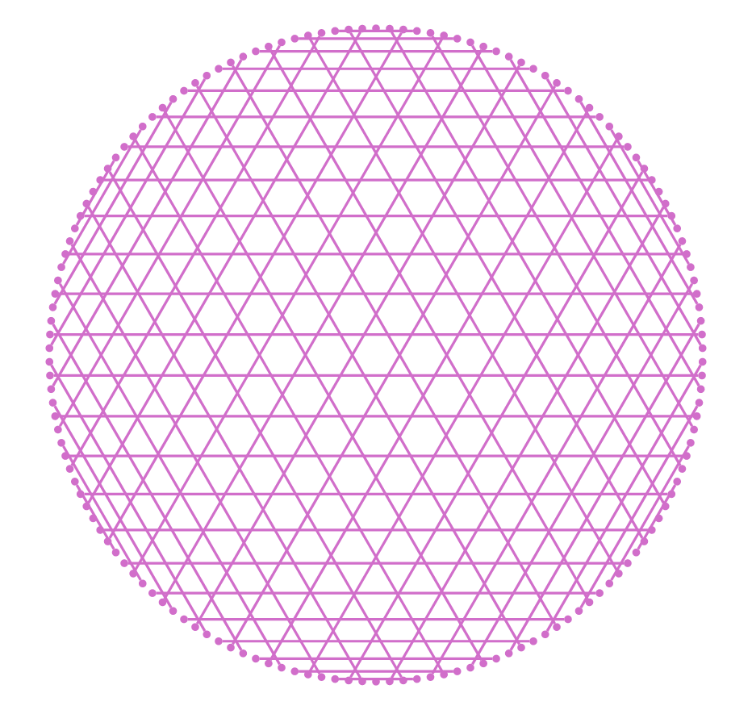

# Times Table Website

A simple website inspired on the video below, where it's presented a times table visuallization concept. With this visuallization it's possible to create pretty screenshots and enjoy a little bit of the beauty of math.
  

### 🎬 Tabuada de Multiplicacão, Mandelbrot e o Coração da Matemática

  

### 🖼 Gallery

  
  
  
  
  
  
  
  
  

  
---

Made with ❤️ by <strong>VLRTroll :alien: 

